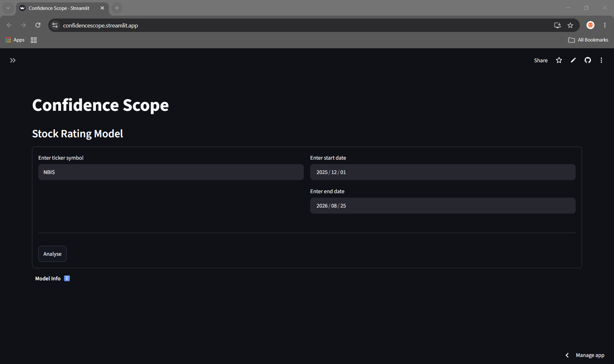
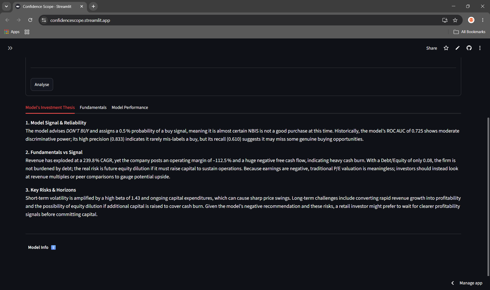
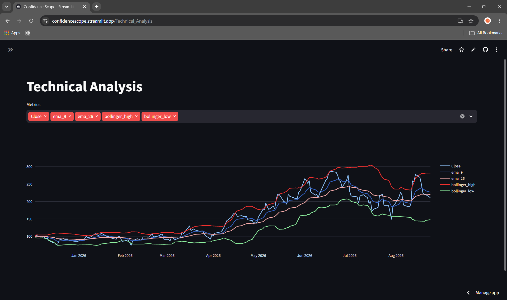
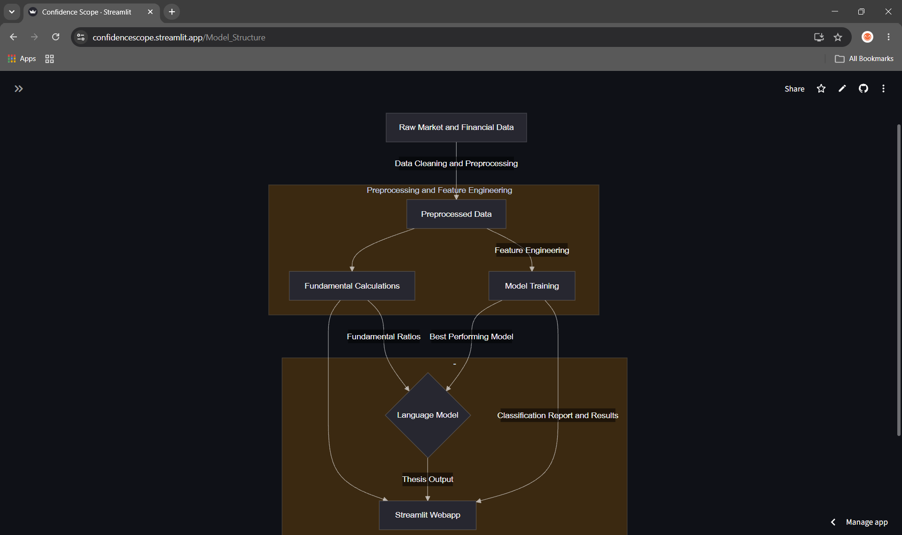

# confidence-lens

An ML and LLM assisted tool that provides buy or don't buy signals for tickers based on company data including price, 
technical indicators, fundamentals and XGBoost classification

Live deployed webapp: https://confidencescope.streamlit.app

1. Tech Stack and environment
Python, use of Alpha Vantage apis for fundamentals data and news and sentiment data. Use of yfinance for stock price data.
Use of ta library in Python for technical analysis metrics. Use of Groq api for language model.
Use of Logistic Regression, XGBoost classifier and Random Forest classifier for predictive signal model. Use of Streamlit for app.

2. Structure and Technical choices
i. Initially was using Finnhub for the news data and Finbert for making sentiment, discovered small limit to range of 
   news dates so switched to Alpha Vantage which had sentiment built into the api and larger date range.
ii. Used ta library as opposed to manually creating technical analysis metrics due to ease and everything I needed was in the library
iii. Tried to use Claude and Gemini as language models but there was no free tier for Claude and Gemini was simply not working for me
iv. Used Logistic Regression as a baseline for my other 2 models. Use Random Forest and XGBoost classifiers as I wanted the model to produce a ‘Buy’ or ‘Don’t Buy/Hold’ signal. Initially tested on 350 rows of data and a forecast of 10 days. XGBoost proved to be the best overall performing model. Random Forest would likely need more rows of data.
v. Chose to use Streamlit to keep everything within Python as opposed to something like node.js for a symbiotically and simpler structure/project.
vi. Used main.py for local testing with live API calls before plugging into streamlit webapp
vii. Removed all sentiment functions

3. Findings
i. XGBoost outperformed Logistic Regression and Random Forest with 73.1% accuracy, 83.3% precision, 61% recall and 0.725 
ROC AUC score on a chronological 80/20 split
ii. Sentiment features were tested individually and in combination with technical indicators and did not improve any of 
the model performances or results

4. Future Improvements
i. Macroeconomic indicators such as interest rates for market wide context
ii. Comparable company analysis for sector wide analysis and context
iii. Instead of just giving signal on direction, could use regression models to predict range of price change or add
     a return based target
iv. Proper backtesting or adding algorithmic trading options
v. Ability for user to change forecast
vi. Walk forward validation to avoid overfitting further and gives true equity curve on how the model handles new windows
vii. Polish fundamental_calculations.py for example replacing fixed values
viii. Increasing amount of data to train model on

5. Limitations
i. Roughly 350 rows of data which means that the model's performance might not be completely accurate. i.e. performance 
   may have been skewed by a bull or bear run
ii. Single chronological split as opposed to walk-forward/expanding window. Walk-forward validation would be better for 
    training this particular model as the stock market is not a static or predicatable entity

6. Requirements
Python 3.12
API Keys;
Alpha Vantage : https://www.alphavantage.co/support/#api-key
Groq : https://console.groq.com/keys

7. Quick start
1. Clone repo
git clone https://github.com/leighchoy/confidence-lens.git
cd confidence-lens
2. Install dependencies
pip install -r requirements.txt
3. Create .env file in project root with your api keys
ALPHAV_API_KEY = your_key
GROQ_API_KEY = your_key
4. Run app locally
streamlit run src/Confidence_Scope.py

